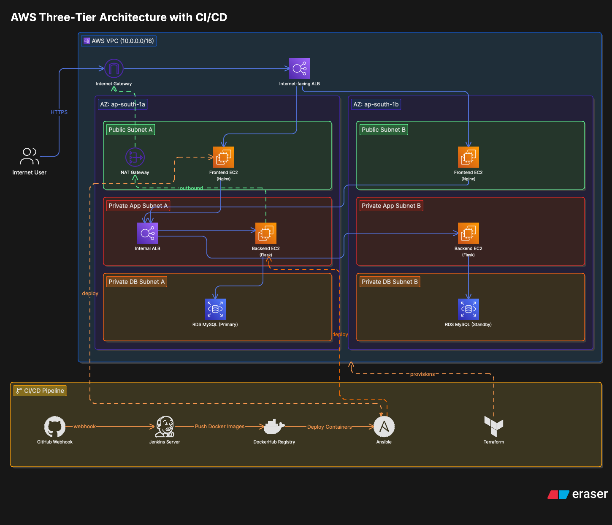
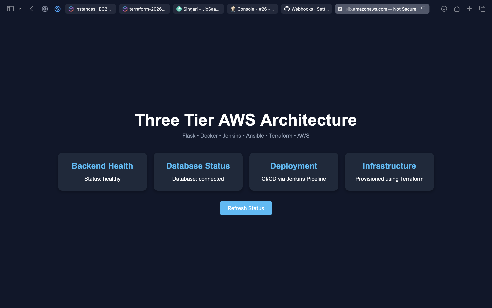
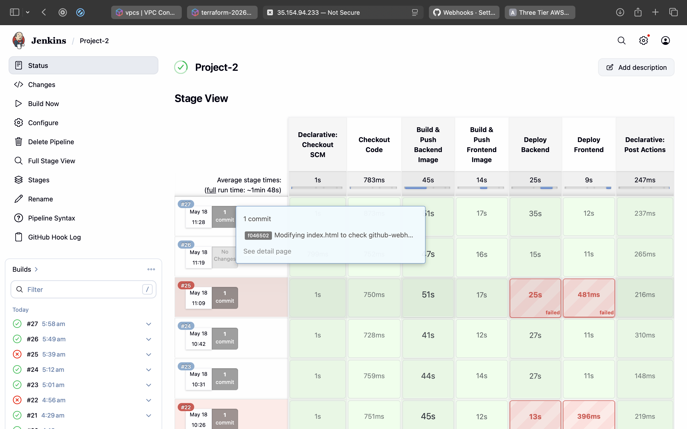
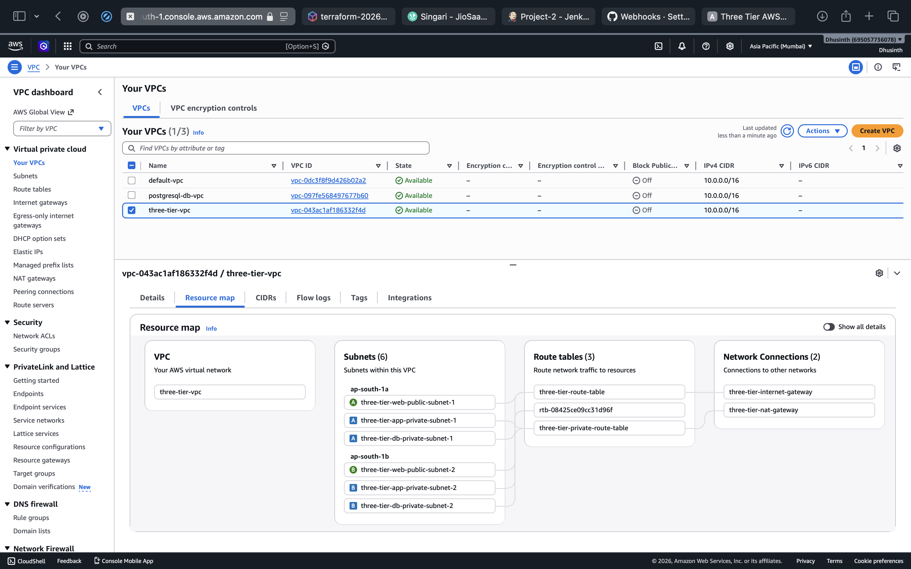

# 🚀 AWS Three-Tier Architecture with CI/CD Automation

A production-style AWS Three-Tier Architecture project built using **Terraform, Jenkins, Docker, Ansible, Flask, and Nginx** with fully automated CI/CD deployment.

---

# 📌 Project Overview

This project demonstrates how to design, provision, deploy, and automate a modern cloud-native three-tier application architecture on AWS using Infrastructure as Code and DevOps practices.

The complete infrastructure was provisioned using **Terraform** and application deployment was automated using **Jenkins, Docker, and Ansible**.

---

# 🏗 Architecture Overview

## 🔹 Frontend Layer
- Nginx running inside Docker container
- Public subnets
- Internet-facing Application Load Balancer

## 🔹 Backend Layer
- Flask application running inside Docker container
- Private application subnets
- Internal Application Load Balancer

## 🔹 Database Layer
- Amazon RDS MySQL
- Private database subnets

## 🔹 CI/CD Pipeline
- GitHub Webhooks
- Jenkins Pipeline
- DockerHub Registry
- Ansible Automation

---

# 📐 Architecture Diagram



---

# 🛠 Tech Stack

## ☁ AWS Services
- VPC
- EC2
- Application Load Balancer
- RDS MySQL
- Internet Gateway
- NAT Gateway
- Route Tables
- Security Groups

## ⚙ DevOps Tools
- Terraform
- Jenkins
- Docker
- Ansible
- GitHub Webhooks

## 💻 Application Stack
- Flask
- Nginx
- Python
- HTML
- CSS
- JavaScript

---

# ✨ Features

- Infrastructure provisioned using Terraform
- Public and private subnet architecture
- Multi-AZ deployment
- Internet-facing and internal ALBs
- Dockerized frontend and backend applications
- Automated CI/CD pipeline
- GitHub webhook triggered deployment
- Ansible-based deployment automation
- Secure credential management using Jenkins Credentials
- Backend connected to Amazon RDS MySQL

---

# 🔄 CI/CD Workflow

```text
Developer Pushes Code to GitHub
            ↓
GitHub Webhook Triggers Jenkins
            ↓
Jenkins Builds Docker Images
            ↓
Docker Images Pushed to DockerHub
            ↓
Ansible Deploys Containers to EC2 Instances
            ↓
Application Updated Automatically
```

---

# 🌐 AWS Infrastructure

## 🔹 Networking
- Custom VPC
- Internet Gateway
- NAT Gateway
- Public Route Table
- Private Route Table

## 🔹 Subnets
- 2 Public Subnets
- 2 Private Application Subnets
- 2 Private Database Subnets

## 🔹 Load Balancers
- Internet-facing ALB
- Internal ALB

---

# 🖥 Frontend

The frontend is built using:
- HTML
- CSS
- JavaScript
- Nginx

### Features
- Backend health monitoring
- Database connectivity status
- Responsive UI
- Reverse proxy using Nginx

---

# ⚡ Backend

The backend is built using:
- Flask
- Python
- MySQL Connector

## API Endpoints

```bash
/health
/db-check
```

---

# 🐳 Docker

## Frontend Container
- Nginx-based Docker image

## Backend Container
- Flask application containerized using Docker

---

# 📦 DockerHub Images

## Frontend Image
```bash
dhusinth123/frontend
```

## Backend Image
```bash
dhusinth123/flaskapp
```

---

# 🔐 Jenkins Credentials Used

The following credentials were securely managed using Jenkins Credentials Manager:

- DockerHub Credentials
- SSH Private Key
- Database Credentials

No sensitive data was hardcoded inside the repository.

---

# 📜 Jenkins Pipeline Stages

1. Checkout Code
2. Build Backend Docker Image
3. Push Backend Image to DockerHub
4. Build Frontend Docker Image
5. Push Frontend Image to DockerHub
6. Deploy Backend using Ansible
7. Deploy Frontend using Ansible

---

# 📂 Project Structure

```text
Project2-Three-Tier-AWS/
│
├── app/
│   ├── app.py
│   ├── requirements.txt
│   └── Dockerfile
│
├── frontend/
│   ├── index.html
│   ├── style.css
│   ├── script.js
│   ├── nginx.conf
│   └── Dockerfile
│
├── ansible/
│   ├── deploy-backend.yml
│   ├── deploy-frontend.yml
│   └── hosts.ini
│
├── terraform/
│   ├── main.tf
│   ├── variables.tf
│   ├── outputs.tf
│   └── terraform.tfvars
│
├── Jenkinsfile
└── README.md
```

---

# 🔒 Security Best Practices

- Private backend subnets
- Private database subnets
- Internal ALB for backend communication
- Secure secret management using Jenkins Credentials
- No hardcoded database passwords
- NAT Gateway for outbound internet access from private subnets

---

# 🧠 Challenges Faced

During this project, I debugged and solved several real-world DevOps issues:

- Nginx reverse proxy configuration
- Internal ALB communication
- Docker container networking
- Jenkins credential management
- Terraform networking configuration
- Private subnet communication
- Docker image caching issues
- Automated deployment failures
- Container port conflicts
- CI/CD deployment troubleshooting

---

# 📸 Screenshots

## Frontend UI



---

## Jenkins Pipeline



---

## AWS Resource Map



---

# 📚 Learning Outcomes

Through this project, I gained hands-on experience in:

- AWS Networking
- Infrastructure as Code
- CI/CD Automation
- Docker Containerization
- Jenkins Pipelines
- Ansible Automation
- Reverse Proxy Configuration
- Cloud Architecture Design
- Debugging Production-style Issues

---

# 🚀 Future Improvements

- Kubernetes deployment
- HTTPS using ACM and Route53
- Auto Scaling Groups
- Monitoring using Prometheus and Grafana
- Blue-Green deployment
- EKS migration

---

# 👨‍💻 Author

## Dhusinth

GitHub:
https://github.com/Dhusinth

Project Repository:
https://github.com/Dhusinth/Project2-Three-Tier-AWS
